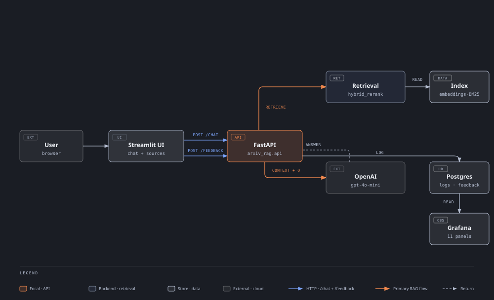

# ArXiv AI Papers RAG Chat

Ask natural-language questions about **10,000 AI/ML research papers** from arXiv
and get an answer **grounded in the retrieved papers, with citations** — plus
👍/👎 feedback and a live Grafana monitoring dashboard.

Capstone project for the [DataTalks.Club LLM Zoomcamp](https://github.com/DataTalksClub/llm-zoomcamp).

## Why this project

arXiv publishes thousands of AI/ML papers, but its search only returns *lists
of papers* — it won't *answer* a question. To find out *"what methods do recent
papers use to evaluate RAG systems?"* you'd have to skim dozens of abstracts
and synthesize the answer yourself. This project is a **RAG
(Retrieval-Augmented Generation)** app that does that for you:

1. Ask a question in plain English in a web chat UI.
2. The app retrieves the most relevant papers with **hybrid search + reranking**.
3. An LLM answers using **only** those papers and cites them inline — if the
   papers don't contain the answer, it says so instead of guessing.
4. Every conversation is logged with cost/latency/tokens, you can rate each
   answer 👍/👎, and a Grafana dashboard monitors the whole system.

## Table of contents

- [Problem description](#problem-description)
- [Data](#data)
- [How it works (summary)](#how-it-works-summary)
- [Installation](#installation)
- [Running the app](#running-the-app)
- [Documentation](#documentation)
- [Evaluation criteria — reviewer map](#evaluation-criteria--reviewer-map)

## Problem description

The project solves the "list of papers vs. answer" problem described in
[Why this project](#why-this-project): a RAG pipeline that retrieves relevant
arXiv papers and produces a **grounded, cited answer**, plus the infrastructure
(ingestion, monitoring, evaluation) to keep it reliable.

## Data

- **Source**: Kaggle dataset
  [`yasirabdaali/arxivorg-ai-research-papers-dataset`](https://www.kaggle.com/datasets/yasirabdaali/arxivorg-ai-research-papers-dataset) —
  10,000 AI research papers from arXiv.
- **Fields used**: `title`, `authors`, `summary` (abstract), `published`,
  `entry_id` (arXiv id), `pdf_url`.
- **Storage**: downloaded to `data/arxiv_ai.csv`, loaded by a dlt pipeline into
  DuckDB (`data/arxiv_papers.duckdb`), then into an in-memory index of
  embeddings + BM25. The app reads DuckDB when present and falls back to CSV.
- **Refresh**: a Kestra flow re-ingests the dataset daily
  (see [Ingestion pipeline](docs/ingestion_pipeline.md)).

## How it works (summary)

<p align="center">
  
</p>

1. **Retrieve** — the question is matched against every paper via the
   configured strategy. The recommended default is `hybrid_rerank`: RRF fusion
   of BM25 + dense embeddings, then a local cross-encoder rerank.
2. **Generate** — the top papers become a numbered context block for
   `gpt-4o-mini`, which answers strictly grounded in that context and cites
   papers as `[1]`, `[2]`, …
3. **Log** — every `/chat` call (question, answer, strategy, tokens, cost,
   latency) is written to Postgres.
4. **Feedback** — 👍/👎 on each answer, stored via `POST /feedback`.
5. **Monitor** — Grafana visualizes volume, latency, cost, tokens, and feedback.

The full deep dive (strategies, prompts, cost tracking, indexing) is in
**[How it works — architecture](docs/architecture.md)**.

## Installation

**Prerequisites**: [uv](https://docs.astral.sh/uv/), Docker with Compose
(optional — only for Elasticsearch/Postgres/Grafana/Kestra/dlt), and an OpenAI
API key.

One command installs the pinned dependencies **and** sets up `.env`:

```
make setup
```

`make setup` will:
1. Create `.env` from `.env.example` if it doesn't exist.
2. Check whether `OPENAI_API_KEY` is set — if not, it **prompts you to paste
   the key** (and writes it to `.env`), or aborts with instructions.
3. Run `uv sync` to install the pinned environment.

You can also do it manually:

```bash
uv sync
cp .env.example .env     # then set OPENAI_API_KEY=... in .env
```

Key variables (full commented list in [.env.example](.env.example)):

| Variable | Default | Purpose |
|---|---|---|
| `OPENAI_API_KEY` | — | **Required.** Used for embeddings and chat completions |
| `OPENAI_CHAT_MODEL` / `OPENAI_EMBEDDING_MODEL` | `gpt-4o-mini` / `text-embedding-3-small` | Models for generation / embeddings |
| `RETRIEVAL_STRATEGY` | `hybrid_rerank` | `hybrid_rerank` (recommended), `hybrid_only`, or `elasticsearch_rrf` (needs Elasticsearch) |
| `HYBRID_CANDIDATE_K` / `RERANK_TOP_K` / `RRF_K` | `100` / `5` / `60` | Hybrid search pool size, final context size, RRF constant |
| `ES_URL` | `http://localhost:9200` | Elasticsearch endpoint (only for `elasticsearch_rrf`) |
| `POSTGRES_HOST/PORT/DB/USER/PASSWORD` | `localhost:5432`, db/user/pass `arxiv_rag` | Conversation + feedback store |
| `BACKEND_URL` | `http://localhost:8000` | Where the Streamlit UI reaches the API |

### Building the index

Before first chat, build the index (embeds all papers — a one-time OpenAI
cost):

```
uv run python scripts/build_index.py
```

To also use the `elasticsearch_rrf` strategy, load Elasticsearch:

```
docker compose up -d elasticsearch
uv run python -c "from arxiv_rag.indexing import get_index; from arxiv_rag.es_search import index_to_elasticsearch; index_to_elasticsearch(get_index())"
```

## Running the app

```
make run
```

Starts both the **API** (`http://localhost:8000`) and the **Streamlit chat UI**
(`http://localhost:8501`) — press `Ctrl+C` to stop both. Or start them in
separate terminals:

```
make api    # uvicorn on :8000
make ui     # streamlit on :8501
```

Sanity-check the API: `curl http://localhost:8000/health`. The interactive
Scalar API client is at `http://localhost:8000/scalar`
(see [API & Scalar](docs/api_scalar.md)).

Optional side infrastructure:

```
make infra      # Elasticsearch + app Postgres (logging)
make monitor    # Postgres + Grafana :3000
make ingestion  # Kestra :8080 + dlt service :8090
make eval       # build index + open the marimo evaluation notebook
```

## Documentation

| Page | Contents |
|---|---|
| [Docs home](docs/README.md) | Index of all documentation pages |
| [How it works — architecture](docs/architecture.md) | Full RAG flow, retrieval strategies, prompts, cost tracking, indexing |
| [API & Scalar](docs/api_scalar.md) | Every FastAPI endpoint, request/response examples, Scalar client |
| [Retrieval evaluation](docs/retrieval_evaluation.md) | The marimo notebook comparing strategies, how to run it, latest results |
| [Monitoring & feedback](docs/monitoring_feedback.md) | Postgres feedback + the 11-panel Grafana dashboard |
| [Ingestion pipeline](docs/ingestion_pipeline.md) | dlt + DuckDB pipeline and the daily Kestra schedule |

## Evaluation criteria — reviewer map

| Criterion | How this project addresses it | Where |
|---|---|---|
| **Problem description** | Problem, data, and end-to-end flow described above with no assumed context | [Problem description](#problem-description), [Data](#data), [How it works](#how-it-works-summary) |
| **Retrieval flow** | Knowledge base (10k papers indexed in Elasticsearch + in-memory NumPy/BM25) and an LLM used together in a RAG flow | [architecture](docs/architecture.md), [`src/arxiv_rag/`](src/arxiv_rag) |
| **Retrieval evaluation** | Three retrieval approaches evaluated (hit rate / MRR, LLM-as-a-judge relevancy, cost, latency, composite score, statistical significance); the winner, `hybrid_rerank`, is the recommended strategy | [Retrieval evaluation](docs/retrieval_evaluation.md), [`notebooks/`](notebooks) |
| **Interface** | Streamlit chat UI (sources, 👍/👎 feedback) on top of a FastAPI backend | [`app_streamlit.py`](app_streamlit.py), [`src/arxiv_rag/api.py`](src/arxiv_rag/api.py) |
| **Ingestion pipeline** | Fully automated: Kestra triggers the dlt ingestion service daily (`@daily` UTC, fresh Kaggle download, concurrency-limited) | [Ingestion pipeline](docs/ingestion_pipeline.md), [`flows/arxiv_ingestion.yml`](flows/arxiv_ingestion.yml) |
| **Monitoring** | User feedback collected in Postgres; Grafana dashboard with 11 panels (volume, cost, latency, tokens, thumbs up/down, ratio, strategy breakdown, timelines, recent conversations) | [Monitoring & feedback](docs/monitoring_feedback.md), [`grafana/provisioning/`](grafana/provisioning) |
| **Containerization** | Elasticsearch, Kestra + its Postgres, the app Postgres, the dlt ingestion service, and Grafana all run via one `docker compose up -d` | [`docker-compose.yml`](docker-compose.yml), [`Makefile`](Makefile) |
| **Reproducibility** | Pinned deps (`uv.lock`), `.env.example` with every variable documented, one-command infra + setup (`make setup`), seeded dataset cache | [Installation](#installation), [.env.example](.env.example) |
| **Best practices** | Hybrid search (BM25 + dense embeddings), document re-ranking (cross-encoder in `hybrid_rerank`), RRF fusion (`elasticsearch_rrf`) | [`src/arxiv_rag/strategies.py`](src/arxiv_rag/strategies.py), [`src/arxiv_rag/rerank.py`](src/arxiv_rag/rerank.py) |