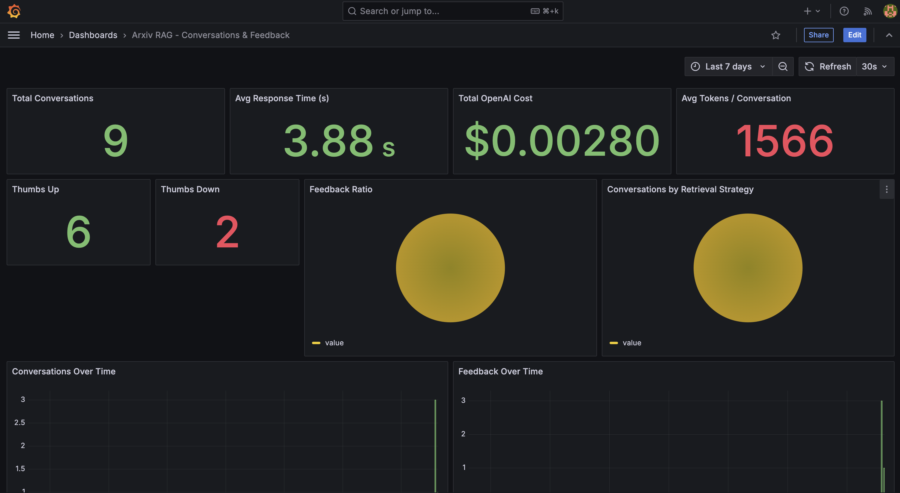
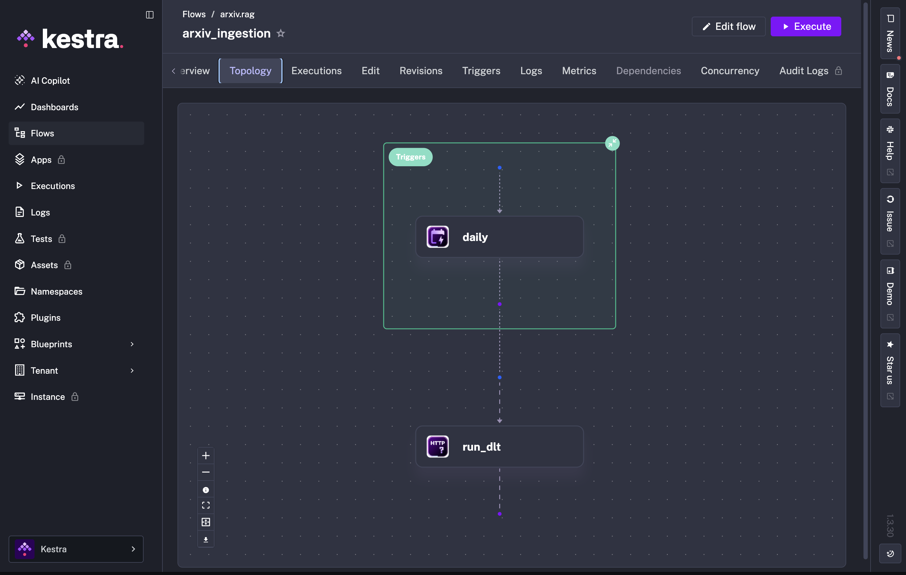
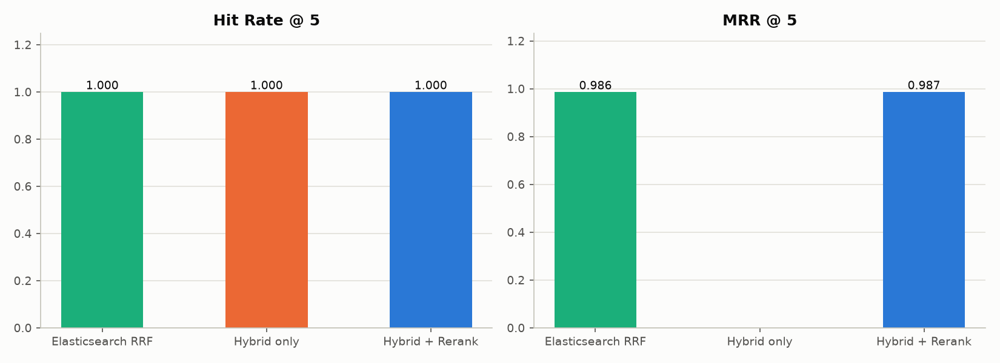
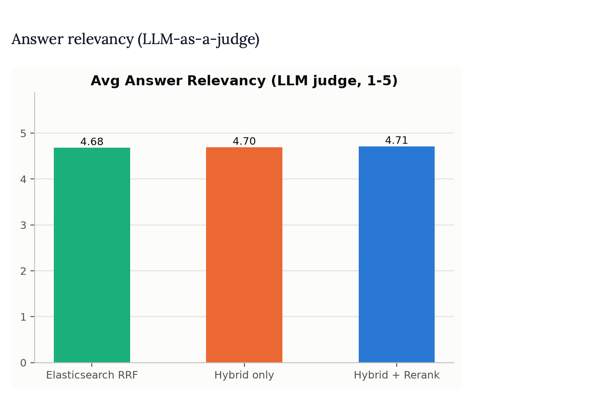

# ArXiv AI Papers RAG Chat

Ask natural-language questions about 10,000 AI/ML research papers from arXiv and get an answer grounded in the retrieved papers, with citations — plus thumbs-up/down feedback and a monitoring dashboard around it.

Capstone project for the [DataTalks.Club LLM Zoomcamp](https://github.com/DataTalksClub/llm-zoomcamp).

## Problem description

arXiv publishes thousands of AI/ML papers, and its search only returns *lists of papers* — not answers. If you want to know "what methods do recent papers use to evaluate RAG systems?", you have to skim dozens of abstracts and synthesize the answer yourself.

This project is a **RAG (Retrieval-Augmented Generation)** application that solves that:

1. You ask a question in plain English in a web chat UI.
2. The app retrieves the most relevant papers from a local knowledge base (hybrid lexical + semantic search).
3. An LLM answers using **only** those retrieved papers and cites them inline — if the papers don't contain the answer, it says so instead of guessing.
4. Every conversation is logged with its cost, latency, and token usage; you can rate each answer 👍/👎, and a Grafana dashboard monitors the whole system.

## Data

- **Source**: Kaggle dataset [`yasirabdaali/arxivorg-ai-research-papers-dataset`](https://www.kaggle.com/datasets/yasirabdaali/arxivorg-ai-research-papers-dataset) — 10,000 AI research papers from arXiv.
- **Fields used**: `title`, `authors`, `summary` (abstract), `published`, `entry_id` (arXiv id), `pdf_url`.
- **Storage**: fetched via `kagglehub` into `data/arxiv_ai.csv`, then loaded by a dlt pipeline into DuckDB (`data/arxiv_papers.duckdb`). The app reads the DuckDB table when it exists and falls back to the CSV otherwise.
- **Refresh**: a Kestra flow re-ingests the dataset daily (see [Ingestion pipeline](#ingestion-pipeline)).

## How it works (RAG flow)

```
User ──▶ Streamlit UI ──POST /chat──▶ FastAPI ──retrieve──▶ Hybrid
  │                                     │                   (RRF)
  │                                     ├──context+question──▶ OpenAI gpt-4o-mini
  │                                     │                      (grounded, cites papers)
  │                                     └──log──▶ Postgres ──read──▶ Grafana dashboard
  └────────────POST /feedback (👍/👎)──────────┘

Kestra (daily schedule) ──▶ dlt ingestion service ──▶ DuckDB ──▶ index rebuild ──▶ Elasticsearch
```

Step by step:

1. **Retrieve** — the question is matched against every paper's `title + authors + summary` using the configured strategy. The recommended strategy is `hybrid_rerank`: NumPy RRF fusion of BM25 (lexical) and dense `text-embedding-3-small` embeddings, then a local cross-encoder rerank of the candidate pool (see [Retrieval evaluation](#retrieval-evaluation)). Two alternates are fully implemented in [src/arxiv_rag/strategies.py](src/arxiv_rag/strategies.py) and selectable via `RETRIEVAL_STRATEGY` in `.env`: `hybrid_only` (same hybrid search, no rerank) and `elasticsearch_rrf` (Elasticsearch's native RRF retriever, fusing BM25 and kNN server-side; requires Elasticsearch running).
2. **Generate** — the top-k papers are formatted into a numbered context block (title, authors, date, summary) and passed to `gpt-4o-mini`, which answers grounded strictly in that context and cites papers as `[1]`, `[2]`, … (see the system prompt in [src/arxiv_rag/rag.py](src/arxiv_rag/rag.py)).
3. **Log** — every `/chat` call is written to Postgres: question, answer, model, retrieval strategy, prompt/completion tokens, USD cost, response time.
4. **Feedback** — each answer in the UI has 👍/👎 buttons that `POST /feedback` with the conversation id and a `+1`/`-1` score.
5. **Monitor** — Grafana reads the Postgres `conversations`/`feedback` tables directly and visualizes volume, latency, cost, tokens, and feedback over time.

## Screenshots

### Chat UI with an example answer


### Cited sources and feedback buttons


### Monitoring dashboard (Grafana)



### Scheduled ingestion (Kestra)



### Retrieval evaluation results

The three retrieval strategies compared on a 200-paper sample (retrieval quality, LLM-judged relevancy, cost, latency → composite score):

| Retrieval metrics | Relevancy (LLM-as-a-judge) | Composite score |
|---|---|---|
|  |  |  |

## Evaluation criteria — reviewer map

| Criterion | How this project addresses it | Where |
|---|---|---|
| **Problem description** | Problem, data, and end-to-end flow described above with no assumed context | [Problem description](#problem-description), [Data](#data), [How it works](#how-it-works-rag-flow) |
| **Retrieval flow** | Knowledge base (10k papers indexed in Elasticsearch + in-memory NumPy/BM25) and an LLM used together in a RAG flow | [src/arxiv_rag/rag.py](src/arxiv_rag/rag.py), [src/arxiv_rag/strategies.py](src/arxiv_rag/strategies.py) |
| **Retrieval evaluation** | Three retrieval approaches evaluated (hit rate / MRR, LLM-as-a-judge relevancy, cost, latency, composite score); the winner, `hybrid_rerank`, is the recommended strategy | [notebooks/retrieval_evaluation.py](notebooks/retrieval_evaluation.py), [docs/retrieval_evaluation.pdf](docs/retrieval_evaluation.pdf), [Retrieval evaluation](#retrieval-evaluation) |
| **Interface** | Streamlit chat UI (sources, 👍/👎 feedback) on top of a FastAPI backend | [app_streamlit.py](app_streamlit.py), [src/arxiv_rag/api.py](src/arxiv_rag/api.py) |
| **Ingestion pipeline** | Fully automated: Kestra triggers the dlt ingestion service daily (`@daily` UTC, fresh Kaggle download, concurrency-limited) | [flows/arxiv_ingestion.yml](flows/arxiv_ingestion.yml), [ingestion/](ingestion/README.md) |
| **Monitoring** | User feedback collected in Postgres; Grafana dashboard with 11 panels (volume, cost, latency, tokens, thumbs up/down, ratio, strategy breakdown, timelines, recent conversations) | [Monitoring & feedback](#monitoring--feedback), [grafana/provisioning/](grafana/provisioning) |
| **Containerization** | Elasticsearch, Kestra + its Postgres, the app Postgres, the dlt ingestion service, and Grafana all run via one `docker compose up -d` | [docker-compose.yml](docker-compose.yml), [Dockerfile.ingestion](Dockerfile.ingestion) |
| **Reproducibility** | Full setup below: pinned deps (`uv.lock`), `.env.example` with every variable documented, one-command infra, seeded dataset cache | [Setup](#setup), [.env.example](.env.example) |
| **Best practices** | Hybrid search (BM25 + dense embeddings), document re-ranking (cross-encoder in `hybrid_rerank`), RRF fusion (`elasticsearch_rrf`) | [src/arxiv_rag/strategies.py](src/arxiv_rag/strategies.py), [src/arxiv_rag/rerank.py](src/arxiv_rag/rerank.py), [src/arxiv_rag/es_search.py](src/arxiv_rag/es_search.py) |

## Technologies

Python 3.11 · uv · FastAPI · Streamlit · OpenAI API (`gpt-4o-mini`, `text-embedding-3-small`) · Elasticsearch 8.17 · dlt · DuckDB · Kestra · PostgreSQL 16 · Grafana 11 · Docker Compose · marimo (evaluation notebook)

## Setup

**Prerequisites**: [uv](https://docs.astral.sh/uv/), Docker with Compose, and an OpenAI API key. Kaggle credentials are only needed to download a fresh dataset snapshot.

1. **Install dependencies** (creates the venv from the pinned lockfile):
   ```
   uv sync
   ```
2. **Configure environment**:
   ```
   cp .env.example .env
   ```
   Fill in `OPENAI_API_KEY` (required). Only fill in `KAGGLE_USERNAME`/`KAGGLE_KEY` if `data/arxiv_ai.csv` isn't already present locally and needs to be downloaded via kagglehub.

   Key environment variables (see [.env.example](.env.example) for the full, commented list):

   | Variable | Default | Purpose |
   |---|---|---|
   | `OPENAI_API_KEY` | — | **Required.** Used for both embeddings and chat completions |
   | `OPENAI_CHAT_MODEL` | `gpt-4o-mini` | Model that generates answers |
   | `OPENAI_EMBEDDING_MODEL` | `text-embedding-3-small` | Model used to embed papers |
   | `RETRIEVAL_STRATEGY` | `hybrid_rerank` | `hybrid_rerank` (recommended), `hybrid_only`, or `elasticsearch_rrf` (needs Elasticsearch) |
   | `HYBRID_CANDIDATE_K` | `100` | Candidate pool size for the hybrid search behind `hybrid_rerank` / `hybrid_only`; a larger pool gives the cross-encoder more candidates to pull from |
   | `RERANK_TOP_K` | `5` | Number of candidates kept after the cross-encoder rerank |
   | `ES_URL` | `http://localhost:9200` | Elasticsearch endpoint |
   | `KAGGLE_USERNAME` / `KAGGLE_KEY` | — | Only for fresh Kaggle downloads |
   | `POSTGRES_HOST/PORT/DB/USER/PASSWORD` | `localhost:5432`, db/user/pass `arxiv_rag` | Conversation + feedback store |
   | `GRAFANA_ADMIN_USER` / `GRAFANA_ADMIN_PASSWORD` | `admin` / `admin` | Grafana login |
   | `BACKEND_URL` | `http://localhost:8000` | Where the Streamlit UI reaches the API |

3. **Start the infrastructure** (Elasticsearch, Kestra, both PostgreSQL instances, the dlt ingestion service, Grafana):
   ```
   docker compose up -d --build
   ```
   Kestra is at `http://localhost:8080`; the `arxiv.rag/arxiv_ingestion` flow is loaded from `flows/` and runs daily. To load data immediately, trigger it manually from the Kestra UI, or call the ingestion service once:
   ```
   curl -X POST http://localhost:8090/run \
     -H 'Content-Type: application/json' \
     -d '{"force_download": false}'
   ```
   Set `KAGGLE_USERNAME` and `KAGGLE_KEY` in `.env` before relying on the scheduled refresh, which passes `force_download: true`.
4. **Build the index** (embeds all papers — one-time OpenAI cost) and load Elasticsearch:
   ```
   uv run python scripts/build_index.py
   uv run python -c "from arxiv_rag.indexing import get_index; from arxiv_rag.es_search import index_to_elasticsearch; index_to_elasticsearch(get_index())"
   ```

After a scheduled dataset refresh, rerun `uv run python scripts/build_index.py --force-rebuild` and then the Elasticsearch load command so changed papers become searchable.

For a local dlt run without Kestra:

```
uv run python -m ingestion.dlt_pipeline
uv run python -m ingestion.dlt_pipeline --force-download
```

## Running the app

Start the API:
```
uv run uvicorn arxiv_rag.api:app --host 0.0.0.0 --port 8000 --reload
```

In a second terminal, start the chat UI:
```
uv run streamlit run app_streamlit.py
```

Open the URL Streamlit prints (usually `http://localhost:8501`). Sanity-check the API with `curl http://localhost:8000/health`.

Every question is logged to Postgres as soon as the API answers it; the API creates the `conversations`/`feedback` tables on startup if they don't exist yet. If Postgres isn't reachable, chat still works — logging and the feedback buttons are just silently disabled.

## Retrieval evaluation

```
uv run marimo edit notebooks/retrieval_evaluation.py
```

Compares `hybrid_rerank`, `hybrid_only`, and `elasticsearch_rrf` on a 200-paper sample: retrieval quality (hit rate / MRR), answer relevancy (LLM-as-a-judge), token cost, and latency, combined into an adjustable composite score. A written report of the results is in [docs/retrieval_evaluation.pdf](docs/retrieval_evaluation.pdf); see [notebooks/README.md](notebooks/README.md) for full notebook instructions. The evaluation found `hybrid_rerank` the best overall — best hit rate / MRR / answer relevancy, and its edge over `hybrid_only` is statistically significant (paired Wilcoxon signed-rank, p < 0.05). Set `RETRIEVAL_STRATEGY=hybrid_rerank` in `.env` to use it (the default), no code changes needed.

## Monitoring & feedback

Each assistant reply gets 👍/👎 buttons in the Streamlit UI, which `POST /feedback` with the conversation's id and a `+1`/`-1` score.

The `grafana` service (`docker compose up -d grafana`, then open `http://localhost:3000`, default login `admin`/`admin`) auto-provisions a Postgres datasource and the **"Arxiv RAG - Conversations & Feedback"** dashboard from [grafana/provisioning/](grafana/provisioning) — no manual setup needed. Its 11 panels: total conversations, avg response time, total OpenAI cost, avg tokens/conversation, thumbs up, thumbs down, feedback ratio, conversations by retrieval strategy, conversations over time, feedback over time, and a recent-conversations table. To change the dashboard, edit `grafana/provisioning/dashboards/rag_feedback.json` and restart the `grafana` container (or edit it live in the Grafana UI and export the JSON back).

## Ingestion pipeline

The dataset refresh is fully automated: Kestra ([flows/arxiv_ingestion.yml](flows/arxiv_ingestion.yml)) calls the dlt ingestion HTTP service daily at midnight UTC with `force_download: true`, concurrency-limited to one run. The dlt pipeline downloads the latest Kaggle snapshot, cleans it, builds the shared `index_text` field, and loads it into the `arxiv_data.arxiv_papers` DuckDB table with `replace` write disposition (each run is a complete, consistent refresh — no duplicates). Full details: [ingestion/README.md](ingestion/README.md).

## Project layout

- `src/arxiv_rag/` — the app package: config, data loading, indexing, the three retrieval strategies, generation, Postgres logging (`db.py`), the FastAPI app.
- `app_streamlit.py`, `scripts/build_index.py` — app entrypoints, at the repo root.
- `ingestion/` — the dlt pipeline and HTTP service invoked by Kestra ([ingestion/README.md](ingestion/README.md)).
- `flows/arxiv_ingestion.yml` — the daily Kestra flow, loaded automatically by Docker Compose.
- `notebooks/` — evaluation only, not used by the running app: `retrieval_evaluation.py` (the marimo notebook comparing retrieval strategies) and `eval_lib.py` (question generation, LLM-as-a-judge, cost/latency metrics).
- `docker-compose.yml` — local Elasticsearch, Kestra + its PostgreSQL metadata store, the dlt ingestion service, the app's own Postgres (conversations/feedback), and Grafana.
- `grafana/provisioning/` — auto-provisioned Postgres datasource and the conversations/feedback dashboard.
- `docs/` — the retrieval evaluation report (`retrieval_evaluation.pdf`) and the screenshots shown above.
