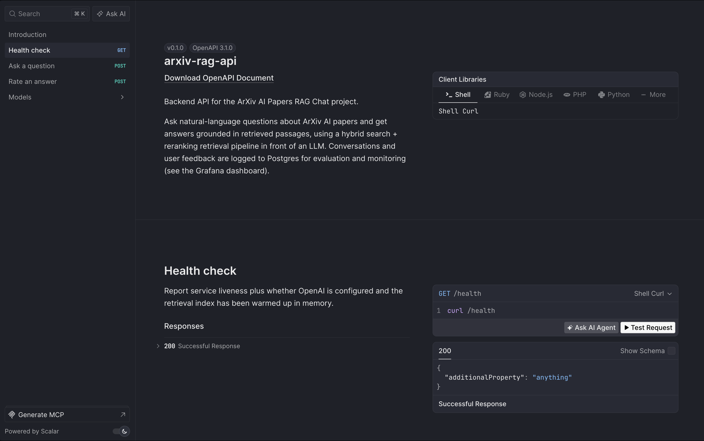

# API & Scalar documentation

The backend is a FastAPI app (`src/arxiv_rag/api.py`, app title
`arxiv-rag-api`) that the Streamlit chat UI talks to over HTTP. It ships with
an interactive **Scalar** client at `GET /scalar` where every endpoint can be
explored and exercised from the browser.

## Opening Scalar

With the API running (`make api`):

```
http://localhost:8000/scalar
```

The same OpenAPI spec is also served by FastAPI's default Swagger UI at
`/docs` and ReDoc at `/redoc`.

## Endpoints

| Method | Path | Summary | Auth |
|---|---|---|---|
| GET | `/scalar` | Interactive API client (Scalar) | none |
| GET | `/health` | Liveness + OpenAI key + index loaded | none |
| POST | `/chat` | Ask a question → grounded answer + sources | none |
| POST | `/feedback` | Rate an answer 👍 (+1) / 👎 (-1) | none |

### `GET /health`: Health check

Liveness probe that also reports whether OpenAI is configured and whether the
retrieval index has been warmed up in memory.

`200 OK`

```json
{
  "status": "ok",
  "openai_configured": true,
  "index_loaded": true
}
```

### `POST /chat`: Ask a question

Answer a question about ArXiv AI papers: retrieves relevant passages with the
configured retrieval strategy, reranks/generates with the LLM, and returns
the answer, cited sources, usage/cost metadata, and a `conversation_id`.

Request body:

```json
{ "question": "How do recent papers evaluate RAG systems?", "top_k": 5 }
```

| Field | Type | Notes |
|---|---|---|
| `question` | string | Required, min 1 char |
| `top_k` | int \| null | 1–20; defaults to `settings.rerank_top_k` (5) |

`200 OK`

```json
{
  "answer": "Several papers evaluate RAG systems using ... [1][2].",
  "sources": [
    {
      "entry_id": "http://arxiv.org/abs/2112.12345v1",
      "title": "Evaluating retrieval-augmented generation",
      "authors": "First Author and Second Author",
      "published": "2021-12-22",
      "pdf_url": "https://arxiv.org/pdf/2112.12345v1",
      "relevance_score": 0.927
    }
  ],
  "model": "gpt-4o-mini",
  "retrieval_strategy": "hybrid_rerank",
  "prompt_tokens": 812,
  "completion_tokens": 164,
  "total_tokens": 976,
  "response_time": 2.431,
  "cost": 0.0002218,
  "conversation_id": 42
}
```

Errors: `503` when the retrieval index/generation layer is not ready,
`500` on a generic failure. `conversation_id` is `null` when Postgres logging
is unavailable (chat still works).

### `POST /feedback`: Rate an answer

Record a thumbs up (`1`) or thumbs down (`-1`) for a previous answer,
identified by the `conversation_id` returned from `POST /chat`.

Request body:

```json
{ "conversation_id": 42, "feedback": 1 }
```

`200 OK`

```json
{ "status": "ok" }
```

Errors: `500` if the row can't be saved.

## How the UI uses the API

`app_streamlit.py` drives most of these endpoints:

| UI element | Endpoint |
|---|---|
| Chat input | `POST /chat` with `{"question": ...}` |
| "Sources" expander | renders `sources[]` from the `/chat` response |
| 👍 / 👎 buttons | `POST /feedback` with the stored `conversation_id` |

## Appendix: dlt ingestion service

The separate ingestion service (`ingestion/service.py`) is also a FastAPI app
(`arxiv-dlt-ingestion`) and exposes:

| Endpoint | Body | Behavior |
|---|---|---|
| `GET /health` | none | `{"status": "ok"}` |
| `POST /run` | `{"force_download": false}` | Runs the dlt pipeline; `409` if already running, `500` on failure |

See [ingestion_pipeline.md](ingestion_pipeline.md) for how Kestra triggers it.

## Screenshot

<table>
<tr>
<td align="center" width="33%"><br><b>Scalar</b><br><sub>Endpoints</sub></td>
</tr>
</table>

## See also

- [`src/arxiv_rag/api.py`](../src/arxiv_rag/api.py): endpoint implementation
- [`src/arxiv_rag/rag.py`](../src/arxiv_rag/rag.py): `RagAnswer` / `SourcePaper` models and the RAG pipeline
- [`docs/architecture.md`](architecture.md): end-to-end flow
- [`Makefile`](../Makefile): `make api`