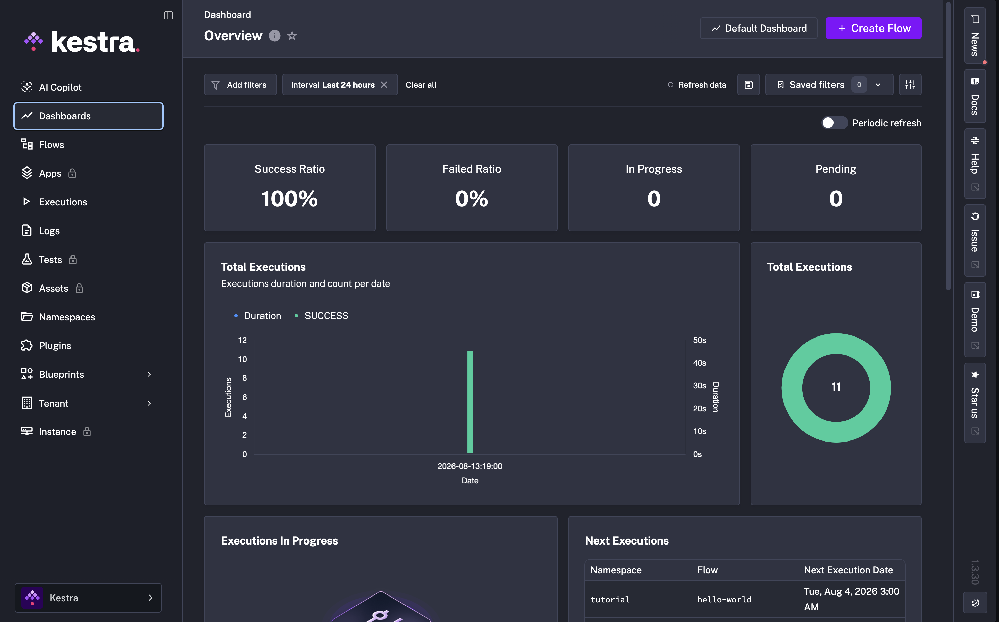
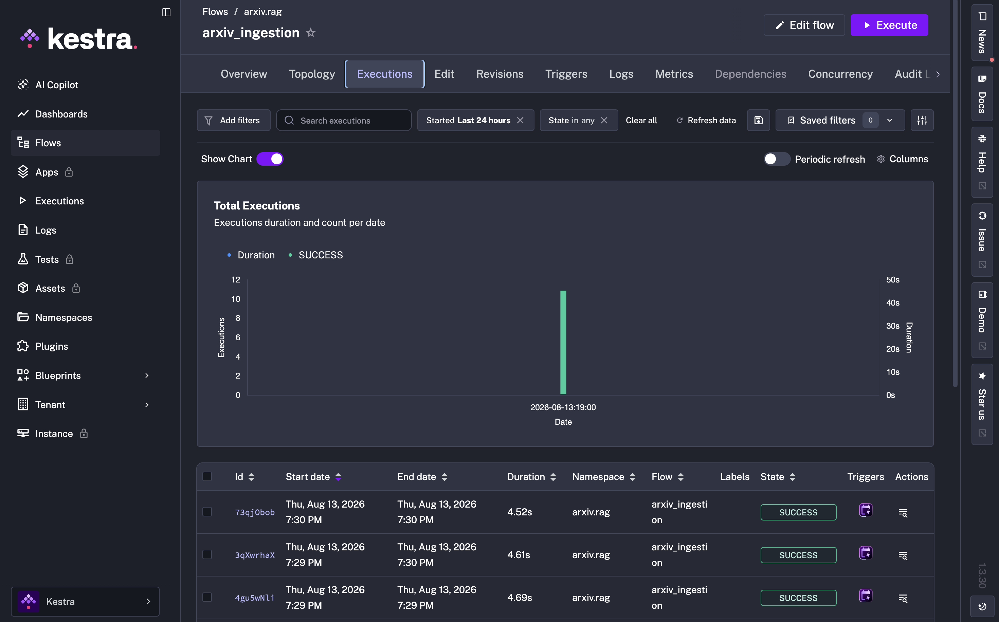

# Ingestion pipeline

The arXiv dataset is kept fresh and searchable by a fully automated pipeline:
**Kestra** schedules a daily run that triggers a **dlt** HTTP service, which
downloads the Kaggle snapshot and loads a cleaned table into **DuckDB**. The
index used by the app is rebuilt from that table.

```
Kestra (@daily, force_download=true)
        └──▶ POST http://dlt-ingestion:8090/run
                  └──▶ dlt pipeline
                        ├── Kaggle snapshot (optional) / local data/arxiv_ai.csv
                        └── DuckDB: arxiv_data.arxiv_papers (replace)
                                    └──▶ scripts/build_index.py --force-rebuild
                                           └──▶ embeddings + BM25 index (+ Elasticsearch load)
```

## Process

1. Read `data/arxiv_ai.csv` (or download the latest Kaggle snapshot when
   `force_download` is enabled).
2. Drop discarded columns and build the shared `index_text` field.
3. Load the records with dlt into the `arxiv_data.arxiv_papers` DuckDB table.
4. Rebuild the RAG index with `scripts/build_index.py --force-rebuild` (and
   load Elasticsearch) so changed papers become searchable.

The dlt resource uses `replace`, so each successful run is a complete,
consistent refresh instead of appending duplicate papers.

## The dlt HTTP service

`ingestion/service.py` is a tiny FastAPI wrapper used by Kestra and by hand:

| Endpoint | Body | Behavior |
|---|---|---|
| `GET /health` | none | Liveness probe |
| `POST /run` | `{"force_download": bool}` | Runs the pipeline; `409` if an ingestion is already running, `500` on failure |

## Configuration

Run commands from the repository root; copy `.env.example` to `.env` first.

The checked-in CSV is enough for a local run. Set `KAGGLE_USERNAME` and
`KAGGLE_KEY` in `.env` only when the pipeline must download a fresh Kaggle
snapshot. Important settings:

| Variable | Meaning |
|---|---|
| `DATA_DIR` | Source and destination data directory |
| `RAW_CSV_FILENAME` | Source CSV name |
| `DLT_DATABASE_PATH` | DuckDB destination path |
| `DLT_DATASET_NAME` / `DLT_RESOURCE_NAME` | DuckDB schema / table name |

## Running it

Start everything (Postgres for Kestra's metadata, the dlt service, Kestra):

```
make ingestion         # docker compose up -d postgres dlt-ingestion kestra
```

- Kestra: `http://localhost:8080`
- dlt service health: `curl http://localhost:8090/health`

### Run the pipeline locally (no Docker)

```bash
uv run python -m ingestion.dlt_pipeline                 # load existing CSV
uv run python -m ingestion.dlt_pipeline --force-download # fresh Kaggle snapshot
```

Verify the output:

```bash
uv run python -c "from arxiv_rag.data import fetch_dlt_dataset; print(len(fetch_dlt_dataset()))"
```

### Trigger via the dlt service

```bash
curl -X POST http://localhost:8090/run \
  -H 'Content-Type: application/json' \
  -d '{"force_download": false}'
```

Use `"force_download": true` for a fresh Kaggle download. Follow logs with
`docker compose logs -f dlt-ingestion`.

## Kestra

The flow in `flows/arxiv_ingestion.yml` is loaded when the Kestra container
starts.

- Namespace: `arxiv.rag` · Flow: `arxiv_ingestion`
- Schedule: daily at midnight UTC, with `force_download: true`
- Concurrent runs limited to one (`concurrency.limit: 1`)
- Calls `http://dlt-ingestion:8090/run` over the Docker Compose network

For a manual run without downloading, execute the flow from the Kestra UI and
leave `force_download` set to `false`.

## After an ingestion

Rerun the index build so new/changed papers become searchable:

```bash
uv run python scripts/build_index.py --force-rebuild
uv run python -c "from arxiv_rag.indexing import get_index; from arxiv_rag.es_search import index_to_elasticsearch; index_to_elasticsearch(get_index())"
```

## Screenshots

<table>
<tr>
<td align="center" width="43%"><br><b>Kestra</b><br><sub>Overview</sub></td>
</tr>
<tr>
<td align="center" width="33%"><br><b>Kestra</b><br><sub>Flow</sub></td>
<td align="center" width="33%"><br><b>Kestra</b><br><sub>Execution</sub></td>
</tr>
</table>

## See also

- [`ingestion/dlt_pipeline.py`](../ingestion/dlt_pipeline.py): the dlt resource and cleaning logic
- [`ingestion/service.py`](../ingestion/service.py): the HTTP wrapper
- [`flows/arxiv_ingestion.yml`](../flows/arxiv_ingestion.yml): the Kestra flow
- [`ingestion/README.md`](../ingestion/README.md): short pointer
- [`Makefile`](../Makefile): `make ingestion`