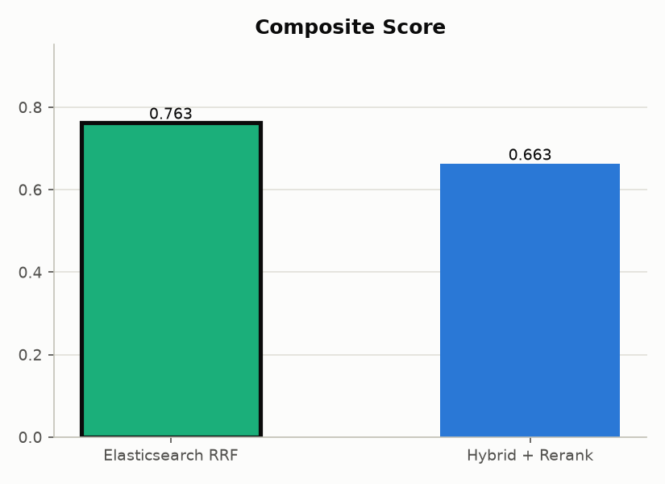

# Retrieval evaluation

The evaluation notebook [`notebooks/retrieval_evaluation.py`](../notebooks/retrieval_evaluation.py)
is a [marimo](https://marimo.io) notebook that compares the three retrieval
strategies on a sample of the arXiv dataset and decides which one should run
in production.

It compares **`hybrid_rerank`** (hybrid + cross-encoder rerank, the current
default), **`hybrid_only`** (same hybrid search, no rerank) and
**`elasticsearch_rrf`** (Elasticsearch's native RRF). They are compared on three
metrics axes: retrieval quality, answer relevancy, cost, and latency.

## How it works

For a random sample of `SAMPLE_SIZE = 200` papers (seed `42`), the notebook:

1. **Generates a synthetic ground-truth question per paper** via `gpt-4o-mini`
   (`eval_lib.generate_question`). The prompt deliberately *avoids* echoing the
   paper's distinctive terms, so the question is a fair test of retrieval
   quality rather than a trivial keyword match.
2. **Runs each strategy** (`strategies.py`, shared with production) on every
   question and records:
   - **Retrieval rank** of the true paper feeds **hit rate @ k** and
     **MRR @ k** (`k = TOP_K = 5`).
   - **Answer relevancy**. The generated answer is judged 1–5 by an
     LLM-as-a-judge (`eval_lib.judge_relevancy`).
   - **Latency**. Retrieval-only and full-request time.
   - **Cost**. OpenAI token usage priced with `eval_lib.PRICING`.
3. **Aggregates** into a per-strategy summary, plus:
   - **Bootstrap 95% CI** per metric (`summary_with_ci`), to tell real gaps
     from run-to-run noise, and
   - a **paired Wilcoxon signed-rank test** between every pair of strategies
     (`paired_significance`), valid because all strategies answer the same
     questions.
4. **Combines** all four axes into a single **composite score** with
   adjustable weights (sliders in the notebook): retrieval 0.30, relevancy
   0.35, speed 0.15, cost 0.20 by default.

> All three strategies share the exact same generation prompt and model.
> Only retrieval differs, so the comparison isolates retrieval quality.

## Prerequisites

1. **Dependencies** from the repo root:
   ```
   make setup            # or: uv sync
   ```
2. **`.env` with `OPENAI_API_KEY`** (the notebook generates questions,
   answers, and judge scores via OpenAI chat completions. A full run costs a
   few dollars and takes ~15–30 min with `MAX_WORKERS = 3`).
3. **Index built** so `get_index()` loads cached embeddings instead of
   re-embedding:
   ```
   uv run python scripts/build_index.py
   ```
4. **Elasticsearch running** (only if you want the `elasticsearch_rrf`
   strategy included):
   ```
   docker compose up -d elasticsearch
   ```
   If ES is unreachable the notebook **drops `elasticsearch_rrf` gracefully**
   and evaluates the two hybrid strategies instead.

## Running it

Easiest: it builds the index, starts Elasticsearch, and opens the notebook:

```
make eval
```

Or directly:

```
uv run marimo edit notebooks/retrieval_evaluation.py    # interactive (recommended)
uv run marimo run  notebooks/retrieval_evaluation.py    # end-to-end from CLI
```

Run from the repo root (or keep `notebooks/` on `PYTHONPATH`) so
`import eval_lib` resolves.

## Configuration cells

At the top of the notebook you can tweak:

| Constant | Default | Meaning |
|---|---|---|
| `SAMPLE_SIZE` | `200` | Number of papers evaluated |
| `TOP_K` | `5` | Retrieval depth for hit rate / MRR |
| `RANDOM_SEED` | `42` | Sample reproducibility |
| `MAX_WORKERS` | `3` | Concurrency (kept low for OpenAI rate limits) |

## Outputs

Written to `artifacts/` at the repo root:

| File | Contents |
|---|---|
| `eval_results.csv` | Raw per-(question, strategy) results |
| `eval_retrieval_metrics.png` | Hit rate / MRR by strategy |
| `eval_relevancy.png` | LLM-judge relevancy by strategy |
| `eval_cost.png` | Cost by strategy |
| `eval_latency.png` | Latency by strategy |
| `eval_composite_score.png` | Composite score by strategy |

## Latest results (run of 2026-08-11)

| Strategy | hit_rate@5 | mrr@5 | relevancy (1–5) | vs `hybrid_only` |
|---|---|---|---|---|
| `hybrid_rerank` | **0.560** | **0.438** | **4.81** | **significant (p < 0.05)** on mrr and relevancy |
| `elasticsearch_rrf` | 0.535 | 0.412 | 4.75 | not significant |
| `hybrid_only` | 0.515 | 0.382 | 4.64 | baseline |

The composite-score leader is **`hybrid_rerank`**, and it is the only strategy
with a statistically validated edge over `hybrid_only` (paired Wilcoxon
signed-rank, p ≈ 0.02 on both MRR and relevancy). Both signals agree, so
`hybrid_rerank` is the recommended strategy, and the production default:

```
RETRIEVAL_STRATEGY=hybrid_rerank   # .env
```

> Why is `hybrid_only`'s hit rate so much lower than intuition suggests? The
> paraphrased questions are intentionally hard: ✓ the true paper reaches the
> top-50 candidate pool only ~77% of the time. `hybrid_only` is RRF's top-5
> cut and leaves papers ranked 6–50 behind, while the reranker rescues ~9 of
> those back into the top 5. The gap is real, not a bug, but it is also
> within the run-to-run noise on most axes, so treat *small* deltas as
> indicative. See the notebook's "Statistical reliability" section.

## Screenshot

<table>
<tr>
<td align="center" width="33%"><br><b>Evaluation Score</b><br><sub>Bar Chart</sub></td>
</tr>
</table>

The relevancy, cost, latency, and composite charts already live in
[`docs/screenshots/`](../docs/screenshots/).

## See also

- [`notebooks/eval_lib.py`](../notebooks/eval_lib.py): question generation,
  LLM-as-a-judge, metrics, and statistics code
- [`notebooks/README.md`](../notebooks/README.md): short notebook pointer
- [`docs/architecture.md`](architecture.md): how retrieval fits the app
- [`Makefile`](../Makefile): `make eval`